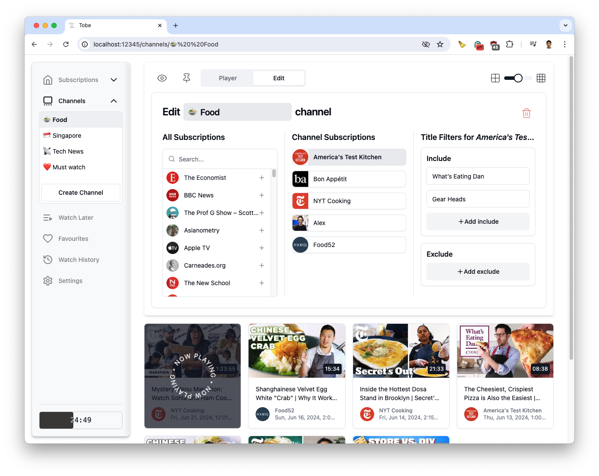
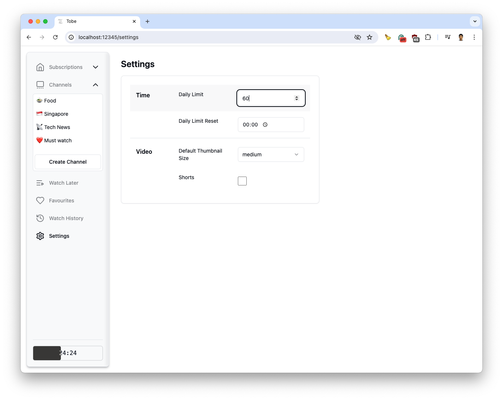

# Tobe 

#### A user-first YouTube video watcher that puts the remote in your hands. 📺 🎛️

**Tobe** pulls only videos of accounts that you have subscribed to and provides you with additional features to organize and filter them.

I created **Tobe** as I wanted more control over my YouTube watching habits. A lot of time is spent watching YouTube videos. **Tobe** aims to foster a healthier watching environment by adding features such as video filtering and channel creation, and removing certain YouTube design patterns (such as autoplay and recommendations) to minimize distraction.

### Features

#### Channel creation

Create channels by combining your subscriptions by theme. You can add 'include' and 'exclude' filters to specify the videos by title.

#### Set time limits

Set a daily time limit to keep track of how much time you have spent on **Tobe**.

### Installation and Setup

Refer to this [Google Doc](https://docs.google.com/document/d/1-1kwc8BPncW82U872F2eX-EaFXsm5cgBr5bh1R11EdU/edit) for step-by-step instructions with pictures on how to set up, install, and get **Tobe** running.

Feel free to leave comments on the doc or an issue on GitHub if you face any difficulties during set up.

### Technologies

- Next.js
- Tailwind CSS
- shadcn/ui
- lucide-react
- IndexedDB + Local Storage
- YouTube v3 API

### Work-in-progress Features

- [ ] Channels summary page `/channels`
- [ ] Favorites `/favorites`
- [ ] Watch Later `/watchlater`
- [ ] Watch History `/watchhistory`
- [ ] More watch time metrics and settings

I built **Tobe** primarily for myself, feel free to make features requests but they will not be my priority. Please feel free to fork the repo and create your own versions!
